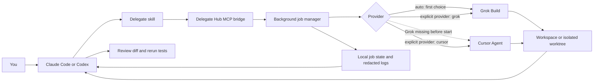

# Agent Delegator

[](https://github.com/ntquang98/agent-delegator/actions/workflows/ci.yml)
[](LICENSE)

Use locally installed [Grok Build](https://docs.x.ai/build/overview) and [Cursor Agent](https://docs.cursor.com/en/cli/overview) as coding workers from Claude Code or Codex. The host remains the orchestrator, observer, and reviewer: it scopes work, starts background jobs, checks results, reviews diffs, and reruns verification.

Agent Delegator is one dual-host plugin with one local stdio MCP bridge. It does not call the xAI or Cursor APIs directly and does not store API keys in plugin configuration.

> [!IMPORTANT]
> Version 0.1.0 ships a Windows x64 bridge. GitHub installation does not require Go. macOS, Linux, Windows ARM64, and WSL binaries are not packaged yet.

## How it works



`provider: auto` starts Grok. It falls back to Cursor only when the Grok executable is missing before execution. It never retries a failed, cancelled, unauthenticated, or out-of-credit Grok job with Cursor because Grok may already have changed the workspace.

You can also start one explicit Grok job and one explicit Cursor job in parallel. Parallel read-only jobs may share a workspace. Write jobs must not share a worktree.

## Requirements

- Windows 10 or 11, x64.
- Current Claude Code or Codex with plugin and local stdio MCP support.
- Grok Build, Cursor Agent, or both installed and authenticated.
- An active provider subscription or credits.
- Git when workers need repository context or isolated worktrees.

You need both provider CLIs only when you want explicit parallel Grok and Cursor jobs. `auto` can operate with Grok alone, or fall back to Cursor when Grok is not installed.

## Set up the worker CLIs

### Grok Build

Install Grok Build using the current [xAI Build documentation](https://docs.x.ai/build/overview), then authenticate and verify it:

```powershell
grok --version
grok login
grok models
```

The bridge runs Grok headlessly with structured JSON, an explicit workspace, bounded turns, and these defaults:

- Read-only: `--permission-mode plan`
- Write: `--permission-mode acceptEdits`
- No web search, subagents, or cross-session memory
- No `--always-approve` or bypass permissions

### Cursor Agent

Install Cursor Agent using the current [Cursor CLI documentation](https://docs.cursor.com/en/cli/overview), then authenticate and verify it:

```powershell
cursor-agent.cmd --version
cursor-agent.cmd login
cursor-agent.cmd status
```

Cursor read-only jobs use `--mode plan`. Native Windows currently does not provide Cursor sandboxing, so Delegate Hub blocks Cursor write jobs on Windows instead of disabling the sandbox silently. Use Grok for write jobs in version 0.1.0.

### Confirm command resolution

If a host cannot find a provider, verify the exact executable selected from the same shell that starts Claude Code or Codex:

```powershell
Get-Command grok -All
Get-Command cursor-agent.cmd -All
```

Restart the host after changing `PATH`.

## Install from GitHub

The repository must be public at [ntquang98/agent-delegator](https://github.com/ntquang98/agent-delegator). These commands work after the repository and bundled Windows binary have been pushed.

### Claude Code

Run these commands inside Claude Code:

```text
/plugin marketplace add ntquang98/agent-delegator
/plugin install delegate-hub@agent-delegator
/reload-plugins
```

Confirm `delegate-hub@agent-delegator` appears in `/plugin list`, then open a new session if its skill or MCP tools are not visible yet.

### Codex

Run these commands in PowerShell:

```powershell
codex plugin marketplace add ntquang98/agent-delegator
codex plugin add delegate-hub@agent-delegator
codex plugin list
```

Open a new Codex task after installation so the new skill and MCP tools are loaded.

## First use

Ask the host naturally. It will use the bundled `delegate` skill and MCP tools.

### Grok-first automatic selection

```text
Use Delegate Hub to inspect this repository for the root cause of the failing test.
Keep the job read-only, use the current workspace, and return a concise diagnosis with file paths.
Observe the job, collect its result, and independently verify the important claims.
```

### Explicit Grok worker

```text
Start a read-only Delegate Hub job with provider grok.
Ask it to map the authentication flow and cite the relevant files.
When it finishes, review the result and spot-check the cited code yourself.
```

### Explicit Cursor worker

```text
Start a read-only Delegate Hub job with provider cursor.
Ask it to find the smallest safe fix for the reported bug without editing files.
Review its recommendation against the current code before changing anything.
```

### Grok and Cursor in parallel

```text
Start two read-only Delegate Hub jobs in parallel in this workspace.
Use provider grok to trace the runtime flow.
Use provider cursor to look independently for failure modes and missing tests.
Observe both jobs, collect both results, reconcile disagreements, and give me your reviewed conclusion.
```

Parallel read-only work is supported. Parallel write work is not safe in one worktree. On Windows 0.1.0, use Grok for writes and keep Cursor read-only.

### Scoped Grok write

```text
Use Delegate Hub with provider grok and mode write.
Only edit bridge/internal/hub/command.go and its test.
Run the focused Go test, then return the diff and test result.
Review the diff yourself and rerun the test before accepting it.
```

## Tools and job lifecycle

| MCP tool | Purpose |
| --- | --- |
| `delegate_start` | Start a background job and return its job ID immediately. |
| `delegate_status` | Read the current job state. |
| `delegate_result` | Read normalized text, provider output, session ID, and request ID. |
| `delegate_cancel` | Stop a running process tree. |

`delegate_start` accepts:

| Field | Values | Default |
| --- | --- | --- |
| `workspace` | Absolute existing directory | Required |
| `task` | Bounded task with expected evidence and verification | Required |
| `provider` | `auto`, `grok`, `cursor` | `auto` |
| `mode` | `read_only`, `write` | `read_only` |
| `maxTurns` | 1-50 | 12 |

Job state and redacted logs are written under `%LOCALAPPDATA%\delegate-hub\jobs`. Task output can still contain private source data, so protect that directory and do not put secrets in delegation prompts.

## Safety model

- Read-only is the default.
- The workspace must be an explicit absolute path.
- Explicit providers never fall back to another provider.
- Grok fallback occurs only before a process starts.
- API key names are redacted from logs, but arbitrary secrets cannot be identified reliably.
- Cursor `--force` and `--yolo` are never used.
- Grok bypass and always-approve modes are never used.
- The host must inspect worker output, review the actual diff, and rerun the target tests.
- Never let two workers write to the same worktree concurrently.

For isolated Grok write work, create a worktree first and pass its absolute path as `workspace`:

```powershell
git worktree add ..\agent-delegator-grok -b worker/grok
```

## Update

### Claude Code

```text
/plugin marketplace update agent-delegator
/plugin update delegate-hub@agent-delegator
/reload-plugins
```

### Codex

```powershell
codex plugin marketplace upgrade agent-delegator
codex plugin add delegate-hub@agent-delegator
```

Open a new task after updating. Both hosts cache installed plugin contents, so an existing task may continue using the previous bridge or skill.

## Uninstall

### Claude Code

```text
/plugin uninstall delegate-hub@agent-delegator
/plugin marketplace remove agent-delegator
```

### Codex

```powershell
codex plugin remove delegate-hub@agent-delegator
codex plugin marketplace remove agent-delegator
```

Removing the plugin does not remove `%LOCALAPPDATA%\delegate-hub\jobs` or uninstall Grok and Cursor.

## Troubleshooting

| Symptom | Check |
| --- | --- |
| Plugin installs but MCP startup fails | Confirm `plugins/delegate-hub/bin/delegate-hub.exe` exists in the installed package. Version 0.1.0 is Windows x64 only. |
| `grok` or `cursor-agent.cmd` is unavailable | Run `Get-Command <name> -All` in the host shell, fix `PATH`, and restart the host. |
| Grok returns 401 or an authentication error | Run `grok login`, then `grok models`. |
| Grok returns 402 or a spending-limit error | Add credits or use an eligible Grok subscription. This does not trigger Cursor fallback. |
| Cursor reports sandbox unavailable on Windows | Use a read-only Cursor job. Use Grok for writes. |
| Job remains `running` | `maxTurns` is not a wall-clock timeout. Check status, then cancel the job if needed. |
| Updated plugin still behaves like the old version | Update the marketplace, reinstall/update the plugin, reload plugins, and open a new task. |
| Two write jobs conflict | Stop one job. Use separate worktrees and review each diff independently. |

## Local development

Go 1.26 or newer is required only when building from source.

```powershell
git clone https://github.com/ntquang98/agent-delegator.git
cd agent-delegator
.\scripts\build.ps1

Push-Location .\bridge
go test .\...
go vet .\...
Pop-Location

claude plugin validate .\plugins\delegate-hub
```

Test the local Claude plugin without installing it:

```powershell
claude --plugin-dir .\plugins\delegate-hub
```

Test the local Codex marketplace:

```powershell
codex plugin marketplace add .
codex plugin add delegate-hub@agent-delegator
```

The build script produces `plugins/delegate-hub/bin/delegate-hub.exe`. That binary is intentionally committed because GitHub marketplace installation copies the plugin package and does not build Go source during installation.

## Publish this repository

Before announcing the GitHub installation commands:

1. Build the Windows x64 bridge with `scripts/build.ps1`.
2. Run the tests and both plugin validators.
3. Confirm `plugins/delegate-hub/bin/delegate-hub.exe` is included by Git.
4. Push the complete repository to `https://github.com/ntquang98/agent-delegator`.
5. Test installation from a clean Claude Code or Codex profile.

```powershell
git init
git add .
git commit -m "Initial Agent Delegator release"
git branch -M main
git remote add origin https://github.com/ntquang98/agent-delegator.git
git push -u origin main
```

## Credits

The dual-host packaging and delegation workflow were informed by:

- [openai/codex-plugin-cc](https://github.com/openai/codex-plugin-cc)
- [yuting0624/antigravity-for-claude-code](https://github.com/yuting0624/antigravity-for-claude-code)

## License

[MIT](LICENSE)
